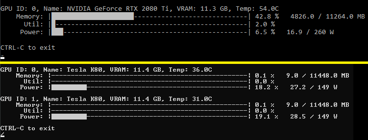

# Simple NV monitor

This is a simple console app to monitor Nvidia GPUs.  It is built with the purpose of helping ML engineers that wish to help tune VRAM footprint as their app runs without having to string a series of print statements into their app or user the rather annoying alternative command line options.

Run this in a separate console window while you run your app.  It will run continuosly until interrupted.

This uses the [nvsmi](https://github.com/pmav99/nvsmi) package which handles the integration work with the Nvidia SMI CLI.

Alternately with just nvidia-smi installed you can

    nvidia-smi -l 2

but, it scrolls your console in a very annoying fashion, or

    watch -n2.0 nvidia-smi

or in Powershell
    
    while (1) {cls; nvidia-smi; sleep 2}

which may be too much information to fit on screen with multiple GPUs and is a bit noisy.

# Install
pip install nvsmi

(safe on Stability Diffusion LDM environment)

* or for more isolation

conda create env -f environment.yaml

conda activate nvsmi

# Run

python run.py
